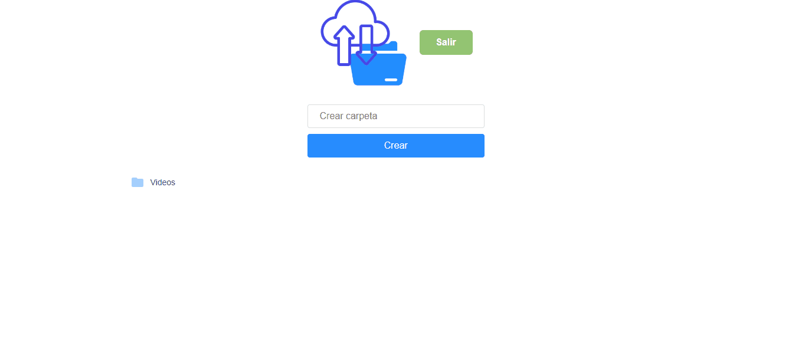

# FILE CLOUD

Simple Cloud Storage app created with Node js, Sequelize, Postgres and JWT. Inspired by the Rocketseat tutorial onmistack week.

<h1 align="center">
    
    <br>
</h1>


<h4 align="center">
  Simple Cloud Storage app with Node js, Sequelize, Postgres and JWT.
</h4>


## 🔥 Application preview

<p align="center">
  
</p>


## Table of Contents
<!--ts-->
  * [Technologies](#technologies)
  * [Project](#project)
  * [How To Use](#how-to-use)
      * [Clone the Repo](#clone-the-repo)
      * [Run the app](#run-the-app)
   * [Contributing](#contributing)
   * [License](#license)
<!--te-->

## 🚀 Technologies

-  [NodeJS](https://nodejs.org/es/)
-  [Sequelize](https://sequelize.org/)
-  [Postgres](https://www.postgresql.org/)
-  [JWT](https://jwt.io/)
-  [SendGrid](https://sendgrid.com/)
-  [React JS](https://es.reactjs.org/)


## 💻 Project

The project ** File Cloud ** is a file storage application inspired by the onmistack week promoted by Rocketseat. In this project JWT was implemented for user authentication and SendGrid for sending emails, it is linked to Cloudinary in case you want to store files on an external server.


## :zap:  How To Use

#### Clone the repo

```jsx
$ git clone https://github.com/SergiioF/file_cloud_frontend.git
```
#### Run the app

```jsx

Then, go to the project folder and install the dependencies and run with the command:

$ yarn && yarn start
```
## 🤔 Contributing

- Fork this repository;
- Create a branch with your feature: `git checkout -b my-feature`;
- Commit your changes: `git commit -m 'feat: My new feature' ';
- Push to your branch: `git push origin my-feature`.

After the merge of your pull request is done, you can delete your branch.

## :memo: License

This project is licensed under the MIT License - see the [LICENSE.md](LICENSE.md) file for details.


Made with ♥ by Sergio Florentin. :wave:


